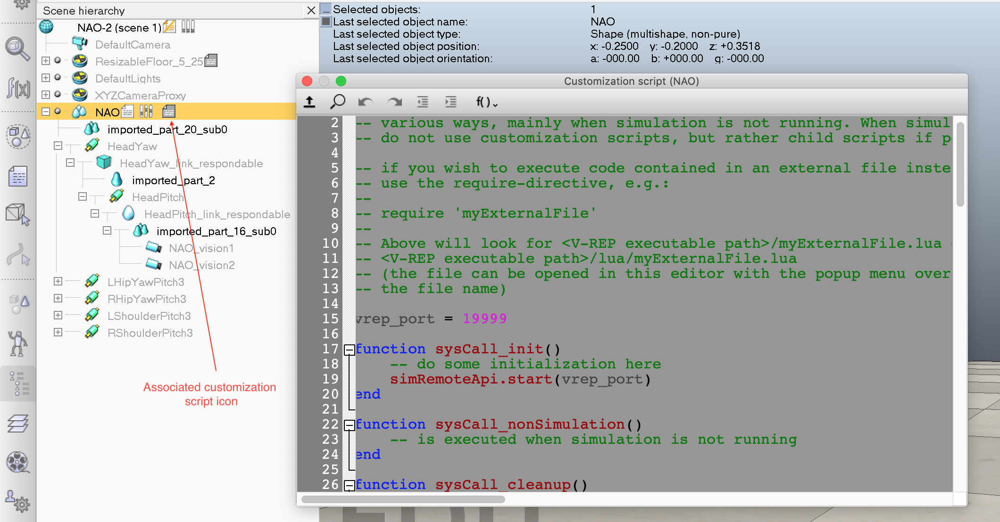
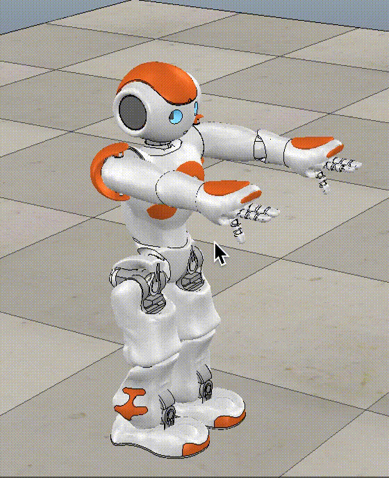
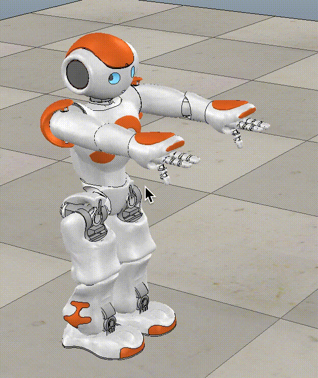
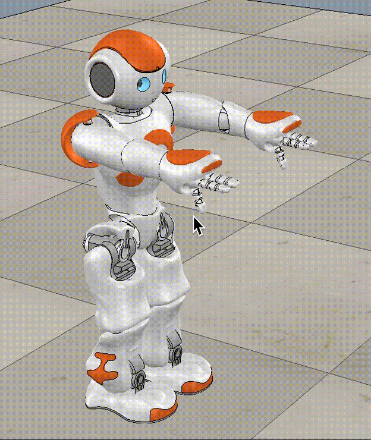
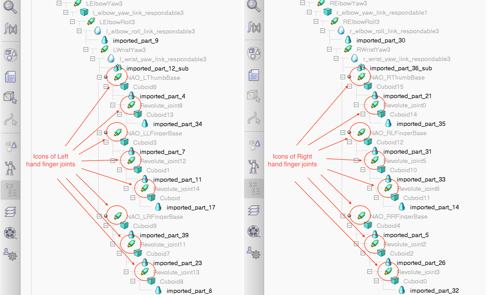
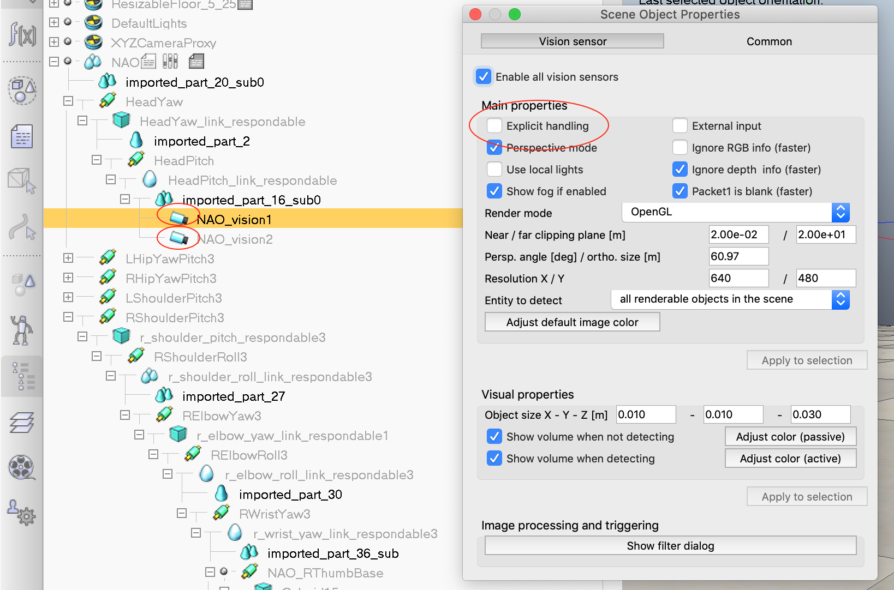

# Robotics praktikum

## Using NAO robot model on V-REP simulator

### Manage the NAO robot scene

#### Start the V-REP program

from command line: `$ vrep.sh`

#### Create new robot scene

from the main menu, select `File\ New scene`

#### Choose physics engine `Bullet` OR `Open Dynamics Engine`

from the main menu, select `Using the Bullet physics engine v2.78`, or `Using
the Bullet physics engine V2.83` or `Simulation\ Using the ODE physics engine`

#### Choose NAO robot model from `Model browser`

from the toolbox `[Model browser]\ robots\ mobile\ NAO.ttm`, drag and drop the
robot to the simulating page

#### Start/ stop/ suspend robot simulation scene

from the main menu, select `Simulation\ <Start>/<Stop>/<Suspend> simulation`

#### Save the robot scene

from the main menu, select `File\ Save scene`

#### Open an existed robot scene

from the main menu, select `File\ Open scene`

#### Scene properties

Scene properties can be examined, adjusted, or added new objects, objects by
expanding (right click on items) the toolbox `[Scene hierarchy]\ [sub-menus]`:

### Program (using python) to control the NAO robot model

NOTE: The default V-REP's NAO robot model has a pre-recorded joints movements
for demonstrating the robot walking, so the robot starts walking when starting
the simulation. It should be removed these codes from the scene before program
to control the NAO robot:

from the toolbox `[Scene hierarchy]\ NAO\ JointRecorder`, select the sub-menu
(right click) `Edit\ Delete selected objects`

#### Enabling the remote API (client side/ python)

copy files `vrep.py, vrepConst.py` from `[V-REP's installation directory]/programming/remoteApiBindings/python`,
and file `remoteApi.dll (windows), or remoteApi.dylib (linux) or remoteApi.so (macos)`
from `[V-REP's installation directory]/programming/remoteApiBindings/lib/lib/<PLATFORM, ARCH>/`
to your programming folder (see <http://www.coppeliarobotics.com/helpFiles/en/remoteApiClientSide.htm>)

#### Enabling the remote API (server side) within V-REP scene

from the toolbox `[Scene hierarchy]\ NAO`, select the sub-menu
(right-click) `Add\ Associated customization script`

Double-click on the `Associated customization script` icon to open the code
editor (LUA programming language) and change code as in picture below. Check
the helper module `naorobot.py` for the relating localhost and port number

This is the convenience to start and stop the V-REP service automatically
whenever run the python code without running the V-REP simulation scene
manually (see <http://www.coppeliarobotics.com/helpFiles/en/remoteApiServerSide.htm>)

#### Helper module for managing NAO robot

python code file `naorobot.py`

Support making new session with V-REP and cleanup at the end. Support reading
current joint angles, writing new angles to joints, and reading current force
sensor data of left and right foot.

#### The 1st example: The robot shakes its head

run python code `python shake_head.py`

The robot stand upright (stand-zero) and shakes its head left-right and
up-down using joints: HeadYaw and HeadPitch

#### The 2nd example: The robot changes its posture

run python code `python change_postures.py`

The robot poses to the move-init posture from the stand-zero posture and vice
versa by change multiple joint angles.

#### The 3rd example: The robot open and close its hands (fingers)

run python code `python openclose_hands.py`

The robot open and close its two hands by change its finger joints.

NOTE: To enable hands manipulating, it has to change the `Control properties`
of finger's joints by double-click on finger's joint's icon in the
`[Scene hierarchy]\ NAO\...` as showned in the below image to open the `Scence
Object Properties` dialog and then click button `Show dynamic properties
dialog` to open the `Joint Dynamics Properties` dialog, and check on `Control
loop enabled` property.

#### The 4th example: Capture images using cameras

run python code `python camera_pictures.py`

Capture images during a movement using two cameras

NOTE: It has to enable vision sensor handling by double-click on the vision
sensor icon to open the `Scene Object Properties` dialog and uncheck the
`Explicit handling` as shown in below image.

#### Additional python packages

* numpy
* matplotlib

#### References

V-REP API framework <http://www.coppeliarobotics.com/helpFiles/en/apisOverview.htm>
